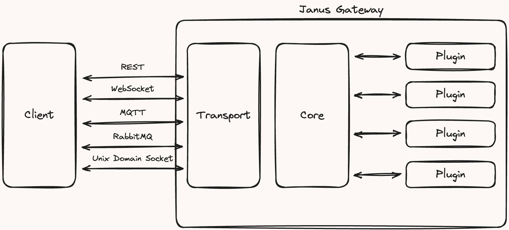

WebRTC 미디어 서버 중 하나인 **Janus Gateway**에 대해 소개합니다!
[Janus 공식 문서](https://janus.conf.meetecho.com/)

> Janus: 범용 WebRTC 서버 (General Purpose WebRTC Server)

# 서론

저는 원격 지원 솔루션을 만드는 회사에서 3년 차 프론트엔드 개발자로 일하고 있습니다
제가 담당하는 서비스 중 하나는 **일대일 비대면 상담** 웹앱인데, 어느 날 새로운 요구사항이 들어왔습니다

> "다중 상담 기능을 추가해 주세요."
> (🚨 갑작스러운 위기 상황)

더 난감했던 건, 당시 코어 로직을 담당하던 팀장님이 막 퇴사하신 직후였다는 점입니다
UI만 다루던 주니어 입장에서 혼자서 이 기능을 구현하는 건 사실상 불가능에 가까운 일이었죠... 😭

하지만 막막함 속에서도, 이 기회를 성장의 발판이라 생각하고 도전하기로 했습니다
서비스 전체 시퀀스를 정리하고, 주변 개발자분들과 본부장님의 조언을 받아 구조를 그려 나갔습니다
기술 검토 과정에서 여러 후보를 비교한 끝에 Janus Gateway를 선택하게 되었고, 이를 계기로 Janus에 대해 정리해 보았습니다.

# Janus란?

- *Janus(야누스)**는 **Meetecho**가 개발한 범용 WebRTC 미디어 서버입니다.
특정 애플리케이션 기능을 직접 제공하지 않고, 대신 다음과 같은 **핵심 기능**을 담당합니다.
- 브라우저와 WebRTC 미디어 통신 설정
- JSON 메시지 교환
- 서버 애플리케이션과 브라우저 간 **RTP/RTCP** 및 메시지 중계

> 📖 용어 정리
> 
> - RTP: 실시간 오디오·비디오 전송 프로토콜
> - RTCP: RTP 스트림의 품질을 모니터링·제어하는 프로토콜

## Janus의 장점

Janus의 가장 큰 특징은 **플러그인 구조**입니다.
필요한 기능이 있다면 Meetecho에서 제공하는 서버 측 플러그인을 붙여 구현할 수 있고, 브라우저는 Janus 코어를 통해 해당 플러그인에 접근합니다.

대표적인 플러그인 예시는 다음과 같습니다.

- Echo Test
- Streaming
- Video Call
- SIP Gateway
- Video Room / Video Room (multistream)
- Audio Room
- Text Room
- Recorder/Playout
- Screen Sharing

> 💡 Janus는 ICE, DTLS, SRTP를 기본 제공하므로, 별도의 구성 없이도 안전한 실시간 통신 환경을 구축할 수 있습니다.
> 

### 왜 이렇게 설계됐을까?

Janus는 **필요한 기능만 가볍게 붙일 수 있도록** 설계되었습니다.
덕분에 다음과 같은 다양한 시나리오에 유연하게 대응할 수 있습니다.

- 클라우드 환경에서 완전한 WebRTC 서버로 배포
- 특정 용도에 맞춘 소형 장비(예: 회의 전용 단말) 구축
- 불필요한 기능을 제거해 최소한의 메모리로 동작

## Janus와 ICE 서버

Janus는 단순한 미디어 서버를 넘어 **ICE 서버 역할**도 수행합니다.
즉, P2P 연결 시 브라우저가 NAT 외부 사용자를 찾고 연결하는 과정을 중개합니다.

일반적으로 WebRTC를 구현하려면,

- STUN 서버: 상대방의 공인 IP·포트를 알아내는 역할
- TURN 서버: 직접 연결이 불가능할 때 중계 역할이 필요합니다.

Janus를 사용하면, 이 역할을 자체적으로 수행하므로 브라우저는 Janus를 통해 P2P 연결을 설정할 수 있습니다.

> 📖 용어 정리
> 
> - SDP: 멀티미디어 세션 설명 프로토콜
> - STUN: NAT 뒤 클라이언트의 위치 확인
> - TURN: NAT 뒤 클라이언트 연결 중계
> - ICE: 다양한 경로 후보를 찾고 최적 연결을 선택하는 프레임워크

# 정리

🔍 정리하자면 Janus Gateway는?

- 플러그인 제공: 다양한 기능을 필요에 맞게 추가 가능
- ICE, DTLS, SRTP 지원: 안전하고 표준화된 통신
- 유연한 구조: 필요한 기능만 경량 배포 가능
- ICE 서버 역할: P2P 연결 중개
- 확장성과 기능성: 다양한 WebRTC 기반 서비스 구축 가능